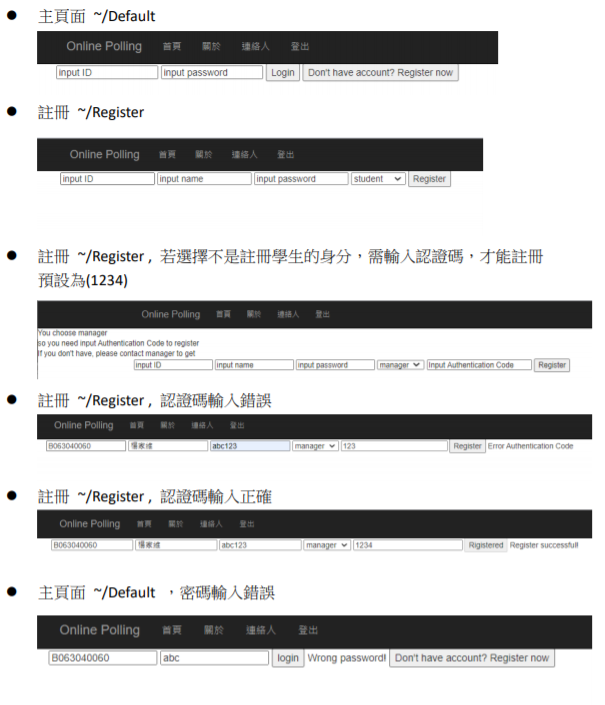

Database LAB Demo

-   主頁面 \~/Default

{width="4.794237751531059in"
height="0.6574070428696412in"}

-   註冊 \~/Register

{width="4.638888888888889in"
height="1.066732283464567in"}

-   註冊 \~/Register , 若選擇不是註冊學生的身分，需輸入認證碼，才能註冊

預設為(1234)

{width="5.768055555555556in"
height="0.8090277777777778in"}

-   註冊 \~/Register , 認證碼輸入錯誤

{width="5.768055555555556in" height="0.68125in"}

-   註冊 \~/Register , 認證碼輸入正確

{width="5.768055555555556in"
height="0.7041666666666667in"}

-   主頁面 \~/Default ，密碼輸入錯誤

{width="5.768055555555556in"
height="1.0013888888888889in"}

-   投票主頁面 \~/vote 。

只會出現有權限投票的投票活動。

身分為管理者才會出現管理使用者按鈕。

{width="4.778105861767279in"
height="2.9907403762029747in"}

-   投票主頁面 \~/vote。 身分不是管理者。 沒有管理使用者按鈕

{width="3.6944444444444446in"
height="2.5189391951006126in"}

-   管理使用者 \~/PermissionManagement , 打勾代表有權限建立投票

{width="4.46875in" height="1.7083333333333333in"}

-   投票主頁面 \~/vote。沒有建立投票權限,沒有管理投票按鈕

{width="2.935184820647419in"
height="2.2655063429571305in"}

-   投票主頁面 \~/vote。 若登出後再進入此頁面 ,只會出現不記名

的投票。

{width="3.7222222222222223in"
height="2.384280402449694in"}

-   投票主頁面 \~/vote。
    點選投票活動，會出現投票簡單敘述，點選開始投票可進行投票。

{width="2.391162510936133in"
height="2.962962598425197in"}

-   進入投票 \~/voting?topic=投票test .

{width="2.03125in" height="1.7916666666666667in"}

-   進入投票 \~/voting?topic=投票test , 有選擇後可按送出

{width="2.96875in" height="2.1875in"}

-   進入投票 \~/voting?topic=投票test,送出後不能再送出第二筆。

{width="3.4907403762029747in"
height="2.26332239720035in"}

-   進入管理投票頁面 \~/VoteManagement 可選擇新增，修改，刪除

{width="4.395833333333333in"
height="0.9166666666666666in"}

-   \~/AddVote 新增投票

{width="2.6574070428696412in"
height="4.3599081364829395in"}

-   輸入日期時會跳出日期框,不可以選擇過去。

{width="2.888888888888889in"
height="2.4915627734033245in"}

-   沒輸入完整。

{width="2.3541666666666665in"
height="1.0520833333333333in"}

-   \~/ModifyVote 只會顯示自己發起的投票

{width="3.875in" height="2.1458333333333335in"}

-   \~/ModifyVote 沒登入 不能修改。

{width="2.0625in" height="1.0208333333333333in"}

-   \~/ModifyVote 調整投票，已有投票紀錄只可更改
    主題，說明，開始結束日期。

{width="2.9444444444444446in"
height="4.868148512685914in"}

-   \~/Delete 勾選並點選確定刪除去刪除整個投票。

{width="1.5in" height="1.53125in"}

-   \~/Result 查看已結束投票的結果

{width="4.739583333333333in" height="1.46875in"}

-   \~/Result 點選查看

{width="2.29629593175853in"
height="5.502836832895888in"}

-   利用cookies 储存登入狀態
    ，登出後刪除，若沒按登出，20分鐘自動登出刪除cookies。

{width="5.768055555555556in"
height="0.9354166666666667in"}
